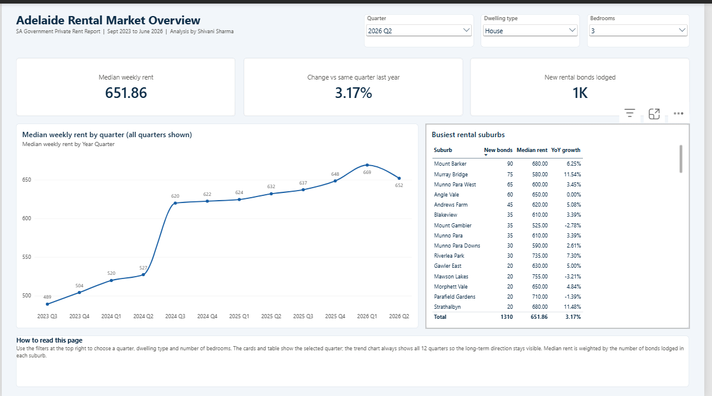
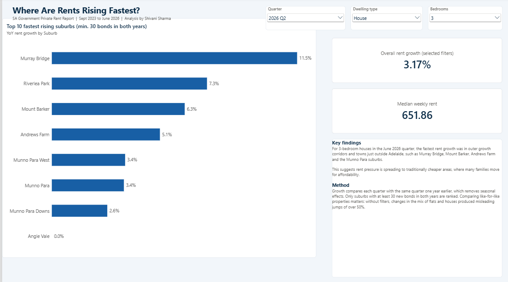
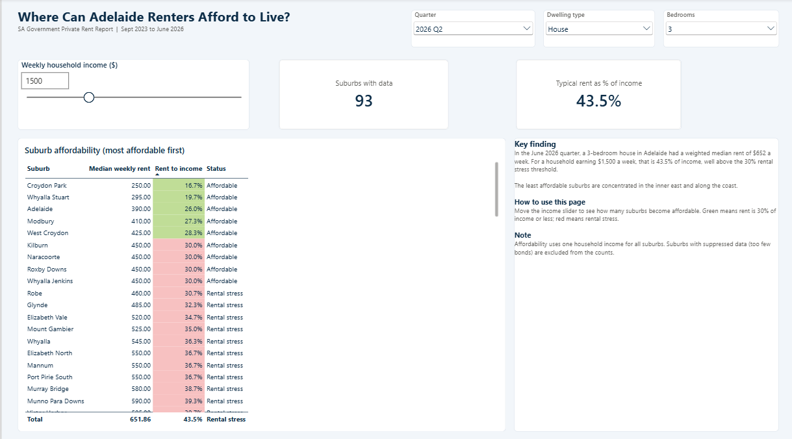
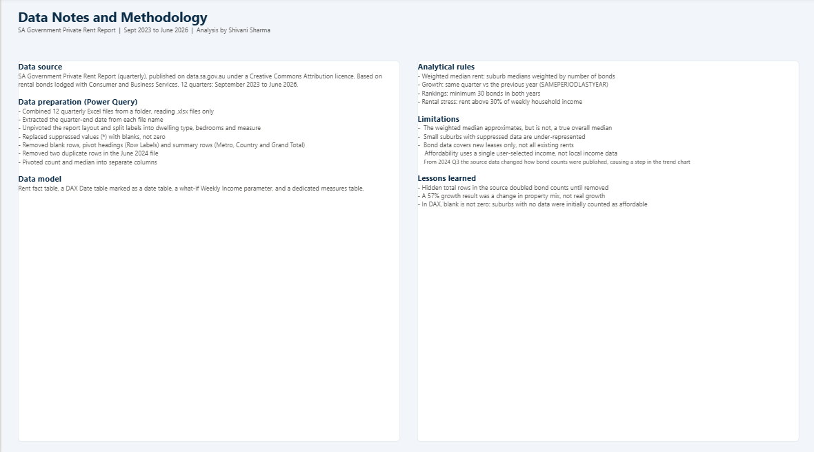

# Adelaide Rental Market & Affordability Analysis (Power BI)

*Independent analysis for portfolio purposes; not affiliated with or endorsed by the SA Government.*

An interactive Power BI report analysing **three years of South Australian rental bond data** (September 2023 – June 2026) to answer one question:

> **Where can Adelaide renters still afford to live, and where are rents rising fastest?**

---

## Business questions

1. How has Adelaide's median weekly rent changed over the past three years?
2. Which suburbs have seen the fastest rent growth, comparing like-for-like properties?
3. At a given household income, which suburbs are affordable (rent ≤ 30% of income) and which put renters in rental stress?

## Data source

- **SA Government Private Rent Report** (quarterly), published by Consumer and Business Services / SA Housing Authority on [data.sa.gov.au](https://data.sa.gov.au/data/dataset/private-rent-report), released under a Creative Commons Attribution licence.
- 12 quarterly Excel files, September 2023 to June 2026.
- Median weekly rent and number of new bonds lodged, by suburb, dwelling type (house / flat) and number of bedrooms.

## Tools

Power BI Desktop · Power Query (M) · DAX · Data modelling (star schema) · What-if parameters

---

## Process

### 1. Data preparation (Power Query)
- Combined 12 quarterly files using **Folder → Combine files**, with a filter so only `.xlsx` files are read (excludes Excel lock files `~$…`).
- Extracted the **quarter-end date** from each file name (e.g. `private-rental-report-2025-06.xlsx` → 30/06/2025).
- **Unpivoted** the wide report layout, then split the attribute labels into Dwelling Type, Bedrooms and Measure.
- Replaced suppressed values (`*`, published when too few bonds were lodged) with **null**, not zero, so they don't drag averages down.
- Removed non-data rows: blank suburbs, Excel pivot headings (`Row Labels`), and summary rows (`Metro Total`, `Country Total`, `Grand Total`) that would otherwise double-count bonds.
- Removed two genuine duplicate rows in the June 2024 file.
- **Pivoted** the Measure column back into separate `Count` and `Median Rent` columns.

### 2. Data model
- **Rent** fact table (Suburb, Dwelling Type, Bedrooms, Quarter Date, Count, Median Rent).
- **Date** table built in DAX covering full calendar years, marked as a date table, with Year Quarter labels and a sort column.
- **Weekly Income** what-if parameter (500 – 4,000) for the affordability analysis.
- Dedicated measures table for all DAX measures.

### 3. Key DAX measures
Full DAX code in [`measures.dax`](measures.dax) and Power Query (M) code in [`rent_query.m`](rent_query.m). Highlights:
- **Weighted Median Rent** – weights each suburb's median by its number of bonds, so a suburb with 3 rentals doesn't count as much as one with 300.
- **Rent YoY Growth %** – same quarter vs. the previous year (`SAMEPERIODLASTYEAR`), returning blank when either year has no data (avoids false −100% results).
- **Reliable YoY Growth %** – only ranks suburbs with at least 30 bonds in both years.
- **Rent to Income %**, **Affordability Status** and **Affordable Suburbs** – driven by the income slider, using the 30% rental stress benchmark.

---

## Report pages

| Page | What it shows |
|---|---|
| **Overview** | Weighted median rent, YoY growth, total bonds, and rent trend across 12 quarters |
| **Rent Growth** | Top 10 fastest rising suburbs (minimum 30 bonds), filterable by quarter, dwelling type and bedrooms |
| **Affordability** | Interactive income slider showing rent-to-income ratio per suburb, colour-coded affordable / rental stress |
| **Data Notes** | Sources, cleaning decisions and limitations |

---

## Key findings (June 2026 quarter)

- A **3-bedroom house** in Adelaide had a weighted median rent of **$652 per week**: **43.5%** of a $1,500 weekly household income, well above the 30% rental stress threshold.
- Across all property types, the weighted median rent was **$584 per week** (38.9% of $1,500).
- The least affordable suburbs were concentrated in the **inner east** and **beachside** areas.
- For like-for-like 3-bedroom houses, the fastest rent growth was in **outer growth corridors and towns just outside Adelaide** (e.g. Murray Bridge, Mount Barker, Andrews Farm, the Munno Para suburbs), suggesting rent pressure is spreading to traditionally cheaper areas.

## Lessons learned

- **The mix effect:** my first growth ranking showed one suburb rising 57%. Filtering to like-for-like properties showed this was a change in the mix of properties leased, not real rent growth.
- **Blank ≠ zero in DAX:** suburbs with no data were initially counted as "affordable" because DAX treats blank as 0. Adding a `NOT ISBLANK` check fixed the count.
- **Hidden summary rows:** source files contained total rows that silently doubled bond counts until removed.

## Limitations

- Medians are published per suburb/dwelling/bedroom group; the weighted median is an approximation of the overall median, not a true median.
- Suppressed values (small samples) are excluded, so smaller suburbs are under-represented.
- Bond data reflects **new leases** in each quarter, not all existing rents.
- Affordability uses a single household income input, not suburb-level incomes.

See [`data-notes.md`](data-notes.md) for full details.

---

## How to open
1. Download `Adelaide_Rental_Analysis.pbix` from this repository.
2. Open it in [Power BI Desktop](https://www.microsoft.com/power-bi/desktop) (free, Windows).
3. Optional: apply the theme from `ocean-blue-theme.json` via View → Themes → Browse for themes.

## Author
**Shivani Sharma** – Microsoft Certified: Power BI Data Analyst Associate (PL-300)
Adelaide, SA · [LinkedIn](https://linkedin.com/in/shivanisharma40285)
